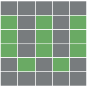

<h1 align="center">Wordle Solver ─ by scarrrr316</h1>

  

<h3 align="center"> <a href="https://www.powerlanguage.co.uk/wordle/">Wordle</a>  is taking Twitter by storm, here is a chrome extension to show the answer.</h3>
<h2 align="center">Setup</h2>
<h3 align="center"> <a href="https://github.com/scarrrr316/wordle-solver/archive/refs/heads/main.zip">Clone the repo</a>  and load it as an <a href="https://developer.chrome.com/docs/extensions/mv3/getstarted/">unpacked extension</a> </h3>
<h2 align="center">Usage</h2>

